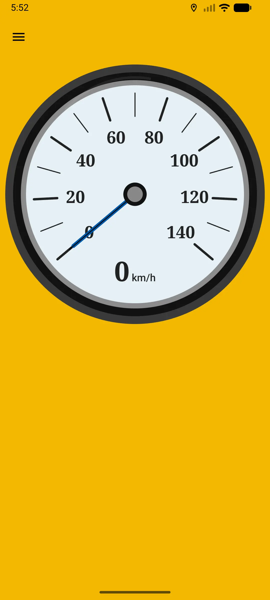
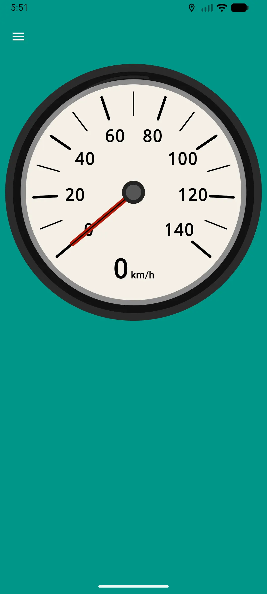
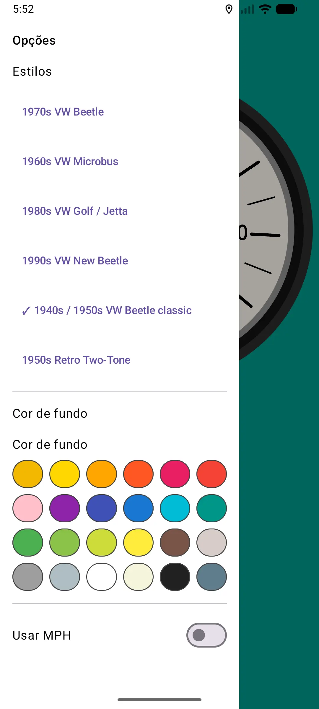
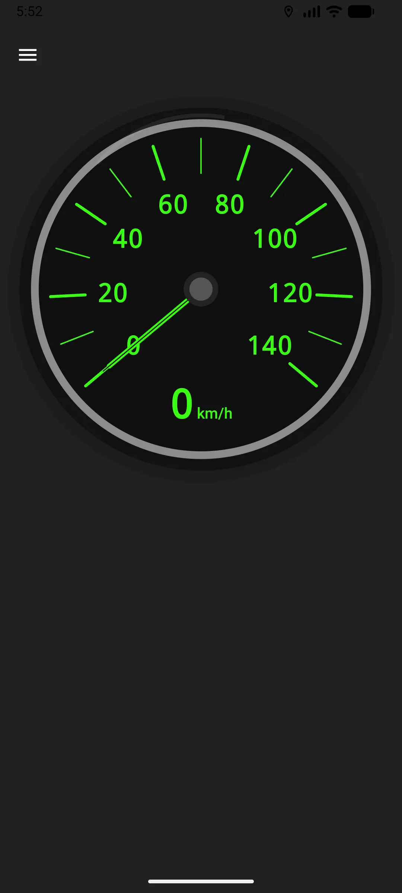

# Buggy Speedometer

A simple **vintage VW-style speedometer** app for your old Buggy dashboards.  
Totally vibe coded in a few hours—because sometimes you just need that retro dashboard feel. 🚗💨

---

## Features

- Classic VW speedometer design with a few vintage styles
- Kotlin Multiplatform (KMP) project
- Designed to run on Android (iOS not tested… use at your own risk 😅)
- Fun, lightweight, and nostalgic

---

## Screenshots

### Retro 50/60's style
<div style="display: flex; gap: 10px;">




</div>

### Options Menu


### Modern VW style


---

## Installation

Clone the repo and open it in Android Studio:

```bash
git clone https://github.com/yourusername/buggy-speedometer.git
```

Build and run on an Android device or emulator.

---

## Usage

Just launch the app on your Android device and enjoy the vintage VW speedometer vibe.  
Perfect for classic Buggy dashboards or just for fun.

---

## Tech Stack

- Kotlin Multiplatform (KMP)
- Jetpack Compose for UI
- Material3 with a retro 50's inspired color palette

---

## Notes

- iOS support is experimental: never tested, might crash 💀
- Totally coded for fun and vibes, not production-ready
- Contributions welcome, but remember: keep it retro. ✌️

---

## License

MIT License – feel free to use, modify, and vibe responsibly.

